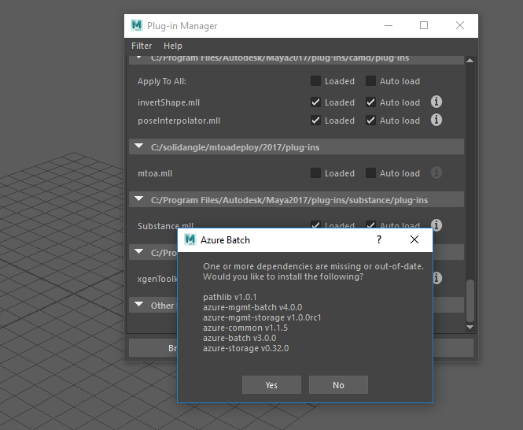
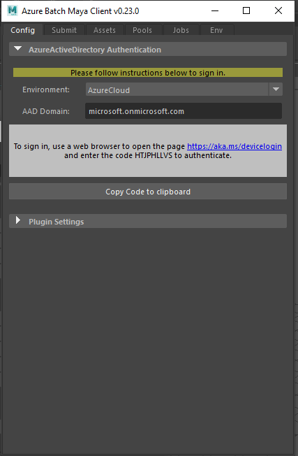

# Azure Batch for Maya

This project demonstrates cloud rendering using the Azure Batch service with integrated licensing for Maya, VRay and Arnold. It is supported for Windows and Mac.

For more information, please see [rendering.azure.com](https://rendering.azure.com).

In order to run this plugin, you will need to [create an Azure Batch account](https://docs.microsoft.com/azure/batch/batch-account-create-portal).
You will also need an `Auto Storage` account configured, which you will have the option to create as part of the Batch account setup.

## Loading the plug-in in Maya and installing dependencies

Download the latest plug-in release and extract the azure_batch_maya directory to a location of your choice.
The plug-in can be run directly from the azure_batch_maya directory.

To install the plug-in:

1. Run Maya
2. Open Window > Settings/Preferences > Plug-in Manager
3. Click `Browse`
5. Navigate to and select azure_batch_maya/plug-in/AzureBatch.py.
6. Once activated, the plug-in shelf will have appeared in the UI.

The first time the plug-in is loaded, you will be prompted to agree to some terms and conditions, and install some Python dependencies.
The downloading and installing of the Python dependencies may take a few minutes, after which you will need to close and reopen Maya to
ensure the updated dependencies are loaded correctly.

Any errors in the dependency install will be logged to the file "AzureBatchInstall.log" in the "azure-batch-libs" folder, which is created for holding dependencies. 
On Windows this is located at: Users\<username>\Documents\maya\<version>\scripts\azure-batch-libs
On Mac this is located at: /Users/<username>/Library/Preferences/Autodesk/maya/<version>/scripts/azure-batch-libs

## Authentication

Before using the plug-in, it will need to be authenticated using your Azure Active Directory (AAD) credentials.
In order to retrieve your AAD tenant:

1. Open the Azure management portal (for public cloud this is [portal.azure.com](https://portal.azure.com) ).
2. Hover over your account name on the upper right-hand side, your AAD Domain will be the bottom value shown, e.g. `contoso.onmicrosoft.com`
3. Open the plugin, select Cloud Environment using the dropdown and copy your AAD domain into the appropriate field
4. Follow the instructions to sign-in by entering the device code provided at [aka.ms/devicelogin](https://aka.ms/devicelogin)

5. Select a Subscription and Batch Account from the dropdown menus in order to complete Batch Account configuration

## Using the Azure Batch plug-in

- [Job configuration](./docs/submitting_jobs.md#job-configuration)
- [Managing assets](./docs/submitting_jobs.md#managing-assets)
- [Environment configuration](./docs/submitting_jobs.md#environment-configuration)
- [Managing Pools](./docs/submitting_jobs.md#managing-pools)
- [Monitoring jobs](./docs/submitting_jobs.md#monitoring-jobs)

## Uninstall

To uninstall the plug-in:

1. Run Maya
2. Open Window > Settings/Preferences > Plug-in Manager
3. Scroll down and find the entry for AzureBatch.py, it may be necessary to expand the folder view
4. Untick the "Load" and "Auto Load" entries for AzureBatch.py
5. Confirm the removal of the shelf 
6. Confirm to remove the dependencies if you wish a clean uninstall

To remove config which is retained for a reinstall, delete the config file "azure_batch.ini". 
On Windows this is located in: Users\<username>\Documents\maya\2017\prefs\AzureBatchData
On Mac this is located at: /Users/<username>/Library/Preferences/Autodesk/maya/<version>/prefs/AzureBatchData

##  Upgrading or reinstalling

When upgrading the plugin, it is recommended to Uninstall the previous version of the plugin, then close and reopen Maya before Installing the new version of the plugin, following the instructions above for Uninstall and Install.

##  Known Installation Issues
There is a bug that even if "Load" and "Auto Load" are both unticked, an entry in the Maya plugin manager for a plugin named AzureBatch.py will cause this entry to be loaded instead, even if you browse to a different folder location and try to load a different AzureBatch.py plugin. 

This entry may be present in the plugin manager when Maya is first loaded, in which case it may be necessary to first load it, then uninstall it and restart Maya in order to allow the new AzureBatch.py to be loaded. 

If the plugin fails during "Load" then it may be necessary to delete the "AzureBatch.mod" file manually. For Windows this is located in:
ProgramFiles\Maya\Maya2017\modules

##  Side-by-side compatibility

Side-by-side installs are supported for Maya 2017 and 2018. The plugin installs and is managed independently in Maya 2017 and 2018, so you can have it installed for both 2017 and 2018 at one time. Each install can be configured for a different Batch account or they can share an account. If the plugin is installed side-by-side, it is recommended that both installs are of the same identical version / release of the plugin.

## Supported Maya Versions
Earlier versions of the code and releases were supported on Maya2017-Update3 only. 

Release v0.14.0 adds support for Maya2017-Update4 and Maya2018.

Release v0.16.0 supports Maya2017-Update5

## License

This project is licensed under the MIT License.
For details see LICENSE.txt or visit [opensource.org/licenses/MIT](http://opensource.org/licenses/MIT).

## Contributing

This project has adopted the [Microsoft Open Source Code of Conduct](https://opensource.microsoft.com/codeofconduct/). 
For more information see the [Code of Conduct FAQ](https://opensource.microsoft.com/codeofconduct/faq/) or contact [opencode@microsoft.com](mailto:opencode@microsoft.com) 
with any additional questions or comments.
