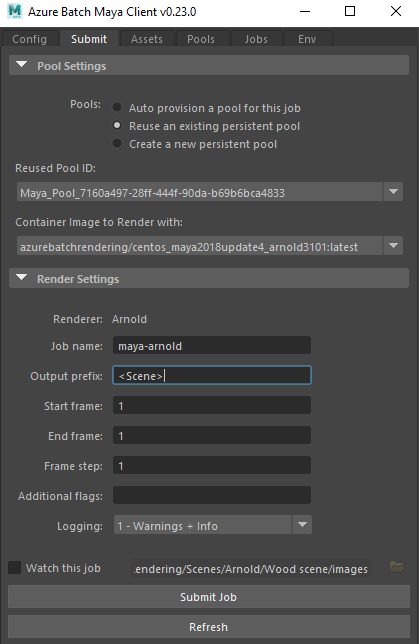
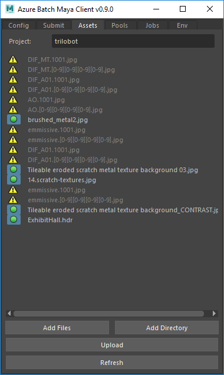
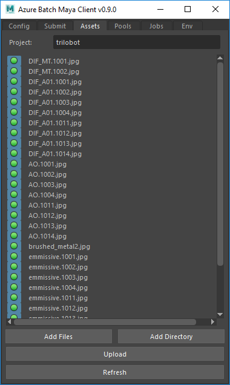
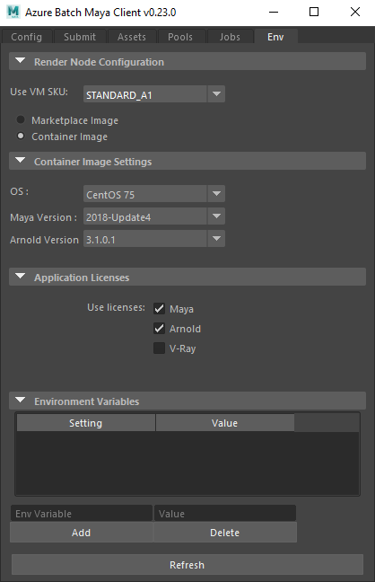
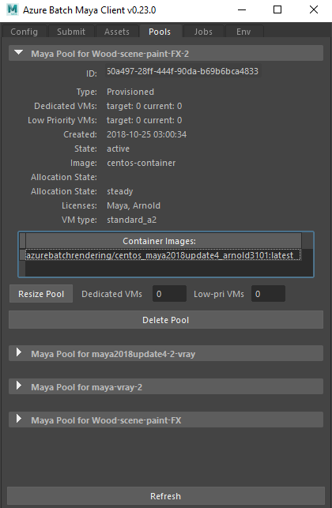
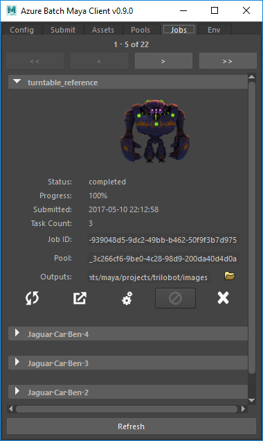

# Submitting render jobs using the Azure Batch plug-in

## Job configuration

The `Submit` tab of the plug-in is where you will configure the basic parameters for the job.
The plug-in will detect which rendering engine you're currently using and display the applicable settings.
The plug-in will also warn you if your selected render engine is not supported.

If you load a new scene while the plug-in is open, click the `Refresh` button to make sure the settings are updated.

### Scene parameters

The basic parameters for your job (start frame, end frame, output prefix etc) will be automatically set based on the render settings of the current scene.
You can override these using the submission UI - any changes you make here will not be persisted back to the scene file render settings, so you can make changes
on a job-by-job basis without needing to re-upload the scene file.

### Pool options

You have the option to determine which VM pool the render will run on. You can pick an existing VM pool, or create a new pool.
When creating a new pool, you can choose to make an `auto pool`, which will run exclusively for this job, and will automatically shut down
on completion of the render. Alternatively you can create a new persistent pool, that will remain available after the render has completed and can
be used for any number of jobs. For more information on managing persistent pools see [managing pools](#managing-pools).
If reusing an existing pool, only pools which have application licenses required by the current scene will be displayed for selection. If reusing a pool
with multiple container images available, a dropdown is presented which allows selection of the container image to use for the job.

## Managing assets

When you load the plug-in it will scan the scene file for any external file references. These references are then display in the `Assets` tab.
If a referenced path cannot be resolved, the plug-in will attempt to locate the file in a few default locations (for example the scene file location, current 
project sourceimages directory and the current working directory).
If the asset still cannot be located, it will be listed with a warning icon.

If you know the location of any unresolved file references, you can click the warning icon and you will be prompted to add a search path. The plug-in will then
use this search path to attempt to resolve any missing assets. You can add any number of additional search paths.

If you are aware of asset references that the plug-in has not detected, additional files, or directories of files can be added using the `Add Files` and 
`Add Directory` buttons.
If you load a new scene while the plug-in is open, be sure to click `Refresh` to make sure the scene is re-parsed for references.

### Uploading assets to a project

When you submit a render, all referenced files (as displayed in the `Assets` tab) will be automatically uploaded. You also have the option to upload the asset
files independently of a job submission, using the `Upload` button on the `Assets` tab.
Assets will be uploaded to a project container in Azure storage, where their file structure will be maintained. This project will be named after the current
Maya project by default. An asset project can be referenced by any number of render jobs, and all assets that have been uploaded to a project will be available to a job that
references that project (regardless of whether a particular asset was explicitly referenced by that scene).
To change the asset project referenced by your next job, simply change the name in the `Project` field in the `Assets` tab.
If there are referenced files that you wish to exclude from uploading, simply unselect it using the green button beside the listing.

## Environment configuration

The `Env` tab will allow you to configure the VMs to be deployed when you create a pool. You can select the VM type and either the Batch provided image (Windows / CentOS) or the 
container image to be run (currently CentOS only). The container image options displayed will change depending on which renderer is active for the current scene. 
If you change scenes with the plugin window open, you will need to click 'Refresh' to trigger this list to update. You can see a list
of VM types and their descriptions in [this article](https://azure.microsoft.com/pricing/details/virtual-machines/series/). 
Only VM's which include 8GB of Memory or greater are available for selection through the plugin, to match the minimum requirements of Maya 2017 / 2018.'
You can also select whether you wish to have the pool licensed for Maya, VRay Arnold. Maya licensing will be enabled by default, whereas VRay or Arnold licensing will be enabled if either
is detected as the active render engine (you may need to click `Refresh` to get the latest scene settings).
If you wish to render using your own license server, you can deselet the license options and configure your license end point by adding the applicable environment variables in the table.
Note that you will be billed for the licensing of applications for the entire up-time of VMs running in the pool, regardless of whether they are being used for rendering.

## Managing Pools

Any persistent pools that have been deployed previously for render jobs from the plug-in can be managed in the `Pools` tab.
Selecting a listed pool will display the current state of the pool, including how many nodes are running, the selected VM image, the VM type and
the licenses that are deployed to that pool.

You can also delete the pool and resize the number of VMs in the pool. A pool can be left at 0 nodes to avoid incurring costs inbetween workloads.

## Monitoring jobs

Once you have submitted a job, you can monitor it both via the [Azure Management Portal](http://portal.azure.com/) and the `Jobs` tab of the plug-in.
Selecting a listed job will display the current state of the job. You can also use this tab to cancel and delete jobs, as well as download the outputs and rendering logs.
To download outputs, use the `Outputs` field to set the desired destination directory, and click the center button (with the gear icon) to start a background process that will
watch the job and download outputs as it progresses. You can close Maya without disrupting the download.

